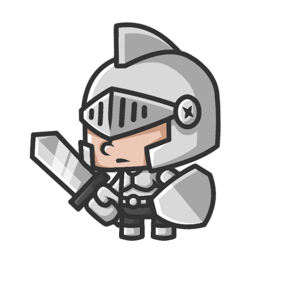
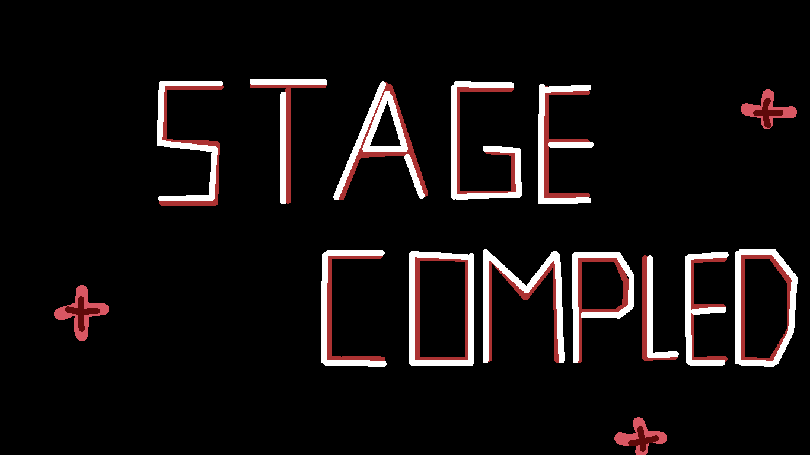
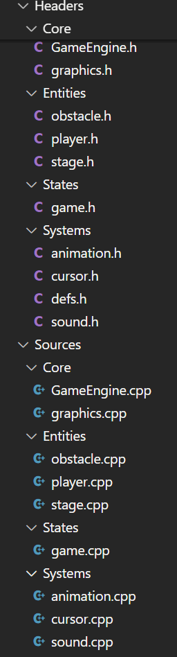
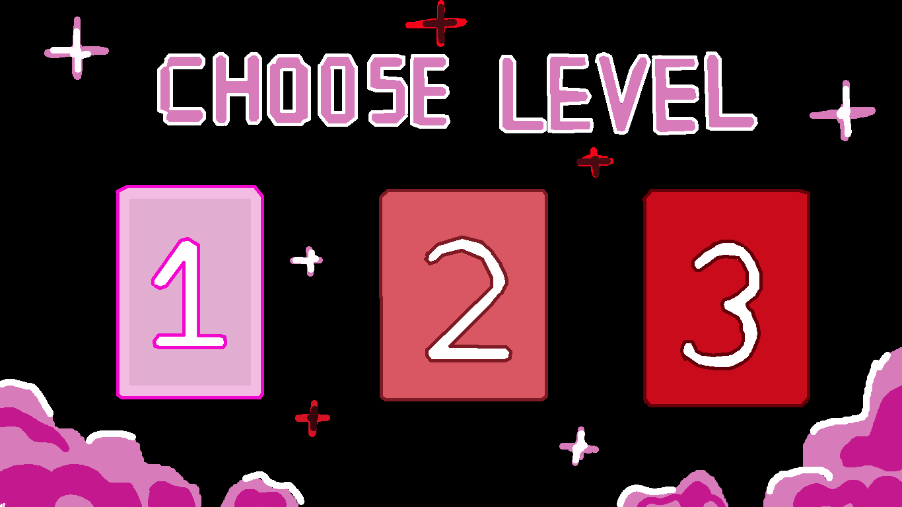
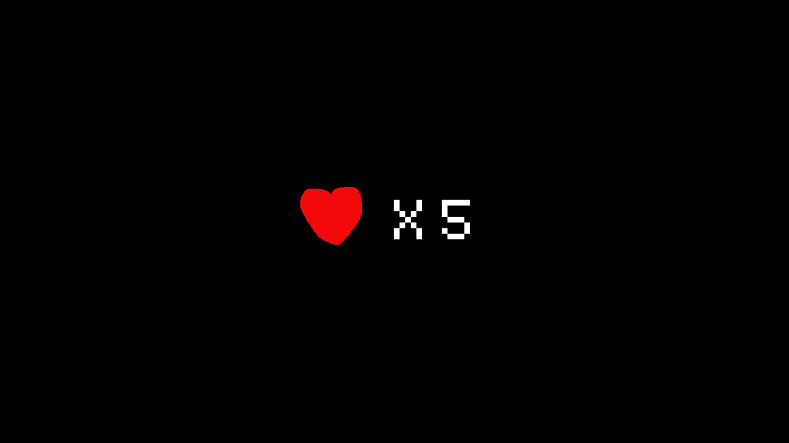
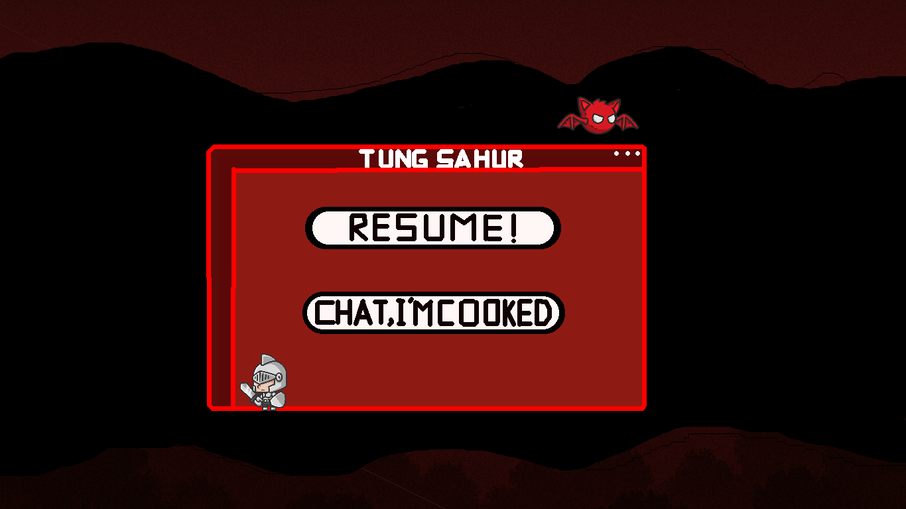
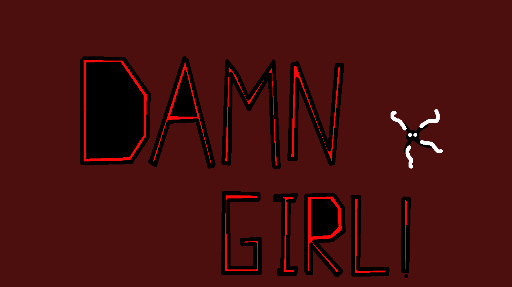
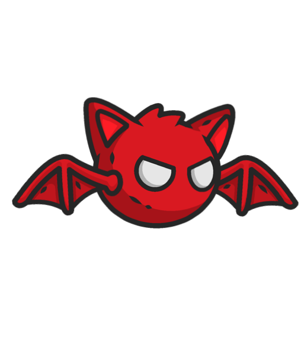

#  **RunMo!** 

<div align="center">
  
</div>

---

# 📃 **English/Tiếng Anh**

## 🎮 **Introduction**

- **Developer:** Nguyen Le Dung - K69I - UET
- **Student ID:** 24022633
- **Game:** RunMo!
- **Demo:** [Watch RunMo! on YouTube](https://youtu.be/JKnO0Bbb6xU)

## 🌟 **Description**

### **Overview**

RunMo! is a 2D platform game developed in C++ using the SDL2 library, created as a project for the Advanced Programming class (2425II_INT2215_12). The game follows a knight character on a challenging journey through various levels with increasing difficulty.

Inspired by the challenging gameplay of "I Wanna Be the Guy: The Movie: The Game (Michael O'Reilly, 2007)", RunMo! offers a simplified yet engaging platforming experience where timing and precision are key.

<div align="center">
  
</div>

### **Game Elements**

- **Introductory sequence** that welcomes players to the game world
- **Interactive main menu** with multiple options
- **Three progressive levels** with unique layouts and challenges
- **Health system** displayed in the top-right corner
- **Enemy encounters** with animated monsters
- **Victory and defeat conditions**

## 🎲 **Gameplay**

### **Controls**

- **Movement:** W/A/S/D or Arrow keys
- **Jump:** Space or W/Up Arrow
- **Attack:** J key
- **Pause:** ESC key
- **Menu Navigation:** Mouse

### **Character Abilities**

- **Running:** Move horizontally across the level
- **Jumping:** Overcome obstacles and gaps
- **Attacking:** Defeat enemies with your sword
- **Platform Detection:** Automatically land on platforms

### **Progression**

Each level introduces new challenges:

- **Level 1:** Basic platforming with gaps to jump over
- **Level 2:** More complex platform arrangements
- **Level 3:** Advanced platforming with enemy encounters

<div align="center">
  
  
  
</div>

### **Health System**

- Player starts with 5 health points
- Health decreases upon falling into pits or enemy contact
- When health reaches zero, it's GAME OVER!
- Health is displayed with visual indicators in the corner

<div align="center">
  
</div>

## 🔧 **Technical Architecture**

The project follows a modular architecture organized by functionality:

<div align="center">
  
</div>

### **Core Components**

- **GameEngine:** The central controller managing the game loop, state transitions, and core systems

  ```cpp
  // Main game loop example
  void GameEngine::run() {
      while (!quit) {
          processInput();
          if (!ingame) {
              handleMenu();
          } else if (isPaused) {
              handlePauseMenu();
          } else {
              handleGameplay();
          }
          SDL_Delay(16); // ~60 FPS
      }
  }
  ```

- **Graphics System:** Handles rendering, texture management, and window operations

### **Entity System**

- **Player:** Implements physics, controls, animations, and state management

  ```cpp
  // Player movement system
  void Player::handleInput(const Uint8 *currentKeyStates, float deltaTime, int level) {
      if (!isKnockback) {
          velocityX = 0;
          if (currentKeyStates[SDL_SCANCODE_LEFT] || currentKeyStates[SDL_SCANCODE_A]) {
              velocityX = -speed;
              animation.currentDirection = Animation::LEFT;
          }
          // More control handling...
      }
  }
  ```

- **Enemies:** Features movement patterns, collision detection, and AI behaviors

### **State Management**

- **Game State System:** Controls transitions between intro, menu, levels, pause, and game over states
- **Level-specific Logic:** Each level has unique platform layouts and collision mechanics

### **Support Systems**

- **Animation:** Sprite-based animation system with frame control
- **Sound:** Background music and sound effect management
- **Input:** Mouse and keyboard input handling
- **Physics:** Gravity, jumping mechanics, and collision resolution

## ✨ **Game Features**

### **Menu System**

<div align="center">
  <table>
    <tr>
      <td></td>
      <td></td>
      <td></td>
    </tr>
    <tr>
      <td>Level Selection</td>
      <td>Audio Settings</td>
      <td>Exit Option</td>
    </tr>
  </table>
</div>

- **Level Selection:** Choose between three progressively difficult levels
- **Audio Settings:** Toggle music and sound effects on/off
- **Exit Game:** Close the application

### **Game States**

<div align="center">
  <table>
    <tr>
      <td></td>
      <td></td>
      <td></td>
    </tr>
    <tr>
      <td>Death Sequence</td>
      <td>Pause Menu</td>
      <td>Victory Screen</td>
    </tr>
  </table>
</div>

- **Death Animation:** Visual feedback when losing health
- **Pause System:** Temporarily stop gameplay with ESC
- **Victory Sequence:** Special animation upon level completion
- **Game Over:** Screen shown when all health is depleted

### **Characters**

<div align="center">
  <table>
    <tr>
      <td></td>
      <td></td>
    </tr>
    <tr>
      <td>Knight (Player)</td>
      <td>Monster (Enemy)</td>
    </tr>
  </table>
</div>

- **Knight:** The playable character with running, jumping, and attack animations
- **Monster:** Enemy that patrols platforms and damages the player on contact

### **Visual & Audio**

- **Sprite Animations:** Fluid character movements using sprite sheets
- **Parallax Backgrounds:** Multi-layered backgrounds for depth
- **Dynamic Sound:** Background music and interactive sound effects
- **Visual Feedback:** Screen effects for important game events

## 🛠️ **Development Details**

### **Technologies Used**

- **Language:** C++
- **Graphics Library:** SDL2 (SDL2_image, SDL2_ttf, SDL2_mixer)
- **Build System:** GNU Make
- **Unity Build Approach:** For efficient compilation

### **Physical Mechanics Implementation**

The game implements custom physics including:

- Gravity and jumping mechanics
- Platform collision detection
- Character knockback on damage
- Attack hitbox calculations

### **Animation System**

Characters and effects use frame-based animations:

- State-based animation selection (idle, running, jumping, attacking)
- Direction-aware sprite rendering
- Smooth transitions between animation states

### **Asset Organization**

Assets are organized by type and purpose:

- Character sprites (idle, attack, jump, run)
- UI elements (menus, cursor, health display)
- Level maps and backgrounds
- Monster animations
- Sound effects and music

## 🏆 **Credits**

- **Game Concept & Programming:** Nguyen Le Dung
- **SDL2 Library References:**
  - [Lazyfoo SDL Tutorials](https://lazyfoo.net/tutorials/SDL/index.php)
  - [Tianchinchiko YouTube Channel](https://www.youtube.com/@tianchinchiko)
  - Class materials from Advanced Programming
- **Graphics:**
  - [OpenGameArt](https://opengameart.org)
  - Self-designed using [LibreSprite](https://github.com/LibreSprite/libresprite.github.io/blob/master/install.md)
- **Audio:**
  - Background Music: [Massah](https://www.newgrounds.com/audio/listen/1412555)
  - Sound Effects: Retro SFX collections
- **Inspiration:**
  - [Phaser Game Framework](https://phaser.io/examples/v3.85.0)
  - [GIVE-UP Project](https://github.com/NPNLong/GIVE-UP?fbclid=IwY2xjawKGtftleHRuA2FlbQIxMABicmlkETE1eDVEVWlzb1V6dmFURDhuAR6yitnHWqIJapz-Lg82sW0wm4693QIQk0DthdXm7jot79TJv8zGP0d7-2yEfQ_aem_4LRSt8B7oUwCqGvp6azH6A)

---

# 📃 **Vietnamese/Tiếng Việt**

## 🎮 **Giới thiệu**

- **Người phát triển:** Nguyễn Lê Dũng - K69I - UET
- **Mã số sinh viên:** 24022633
- **Game:** RunMo!
- **Demo:** [Xem RunMo! trên YouTube](https://youtu.be/JKnO0Bbb6xU)

## 🌟 **Mô tả**

### **Tổng quan**

RunMo! là game nền tảng 2D được phát triển bằng C++ sử dụng thư viện SDL2, được tạo ra như một dự án cho lớp Lập trình nâng cao (2425II_INT2215_12). Game theo dõi một nhân vật hiệp sĩ trong hành trình đầy thử thách qua các cấp độ với độ khó tăng dần.

Lấy cảm hứng từ lối chơi đầy thử thách của "I Wanna Be the Guy: The Movie: The Game (Michael O'Reilly, 2007)", RunMo! mang đến trải nghiệm nền tảng đơn giản nhưng hấp dẫn, nơi thời gian và độ chính xác là chìa khóa.

<div align="center">
  
</div>

### **Các yếu tố của trò chơi**

- **Chuỗi giới thiệu** chào đón người chơi đến với thế giới game
- **Menu chính tương tác** với nhiều tùy chọn
- **Ba cấp độ tiến triển** với bố cục và thách thức độc đáo
- **Hệ thống máu** hiển thị ở góc trên bên phải
- **Gặp quái vật** với hoạt ảnh sinh động
- **Điều kiện chiến thắng và thất bại**

## 🎲 **Lối chơi**

### **Điều khiển**

- **Di chuyển:** W/A/S/D hoặc phím mũi tên
- **Nhảy:** Phím cách hoặc W/Mũi tên lên
- **Tấn công:** Phím J
- **Tạm dừng:** Phím ESC
- **Điều hướng menu:** Chuột

### **Khả năng nhân vật**

- **Chạy:** Di chuyển ngang qua cấp độ
- **Nhảy:** Vượt qua chướng ngại vật và khoảng cách
- **Tấn công:** Đánh bại kẻ thù bằng kiếm của bạn
- **Phát hiện nền tảng:** Tự động hạ cánh xuống nền tảng

### **Tiến trình**

Mỗi cấp độ giới thiệu những thách thức mới:

- **Cấp độ 1:** Nền tảng cơ bản với khoảng cách để nhảy qua
- **Cấp độ 2:** Sắp xếp nền tảng phức tạp hơn
- **Cấp độ 3:** Nền tảng nâng cao với gặp gỡ kẻ thù

<div align="center">
  
  
  
</div>

### **Hệ thống máu**

- Người chơi bắt đầu với 5 điểm máu
- Máu giảm khi rơi xuống hố hoặc tiếp xúc với kẻ thù
- Khi máu về không, GAME OVER!
- Máu được hiển thị bằng chỉ số trực quan ở góc

<div align="center">
  
</div>

## 🔧 **Kiến trúc kỹ thuật**

Dự án theo kiến trúc module được tổ chức theo chức năng:

<div align="center">
  
</div>

### **Thành phần cốt lõi**

- **GameEngine:** Bộ điều khiển trung tâm quản lý vòng lặp game, chuyển đổi trạng thái, và hệ thống cốt lõi

  ```cpp
  // Ví dụ vòng lặp game chính
  void GameEngine::run() {
      while (!quit) {
          processInput();
          if (!ingame) {
              handleMenu();
          } else if (isPaused) {
              handlePauseMenu();
          } else {
              handleGameplay();
          }
          SDL_Delay(16); // ~60 FPS
      }
  }
  ```

- **Hệ thống đồ họa:** Xử lý render, quản lý texture, và hoạt động cửa sổ

### **Hệ thống thực thể**

- **Người chơi:** Thực hiện vật lý, điều khiển, hoạt ảnh, và quản lý trạng thái

  ```cpp
  // Hệ thống di chuyển người chơi
  void Player::handleInput(const Uint8 *currentKeyStates, float deltaTime, int level) {
      if (!isKnockback) {
          velocityX = 0;
          if (currentKeyStates[SDL_SCANCODE_LEFT] || currentKeyStates[SDL_SCANCODE_A]) {
              velocityX = -speed;
              animation.currentDirection = Animation::LEFT;
          }
          // Xử lý điều khiển thêm...
      }
  }
  ```

- **Kẻ thù:** Các mô hình di chuyển, phát hiện va chạm, và hành vi AI

### **Quản lý trạng thái**

- **Hệ thống trạng thái game:** Điều khiển chuyển đổi giữa intro, menu, cấp độ, tạm dừng, và trạng thái game over
- **Logic riêng cấp độ:** Mỗi cấp độ có bố cục nền tảng và cơ chế va chạm độc đáo

### **Hệ thống hỗ trợ**

- **Hoạt ảnh:** Hệ thống hoạt ảnh dựa trên sprite với điều khiển khung hình
- **Âm thanh:** Quản lý nhạc nền và hiệu ứng âm thanh
- **Đầu vào:** Xử lý đầu vào chuột và bàn phím
- **Vật lý:** Trọng lực, cơ chế nhảy, và giải quyết va chạm

## ✨ **Tính năng game**

### **Hệ thống Menu**

<div align="center">
  <table>
    <tr>
      <td></td>
      <td></td>
      <td></td>
    </tr>
    <tr>
      <td>Chọn cấp độ</td>
      <td>Cài đặt âm thanh</td>
      <td>Tùy chọn thoát</td>
    </tr>
  </table>
</div>

- **Chọn cấp độ:** Chọn giữa ba cấp độ có độ khó tăng dần
- **Cài đặt âm thanh:** Bật/tắt nhạc và hiệu ứng âm thanh
- **Thoát game:** Đóng ứng dụng

### **Trạng thái game**

<div align="center">
  <table>
    <tr>
      <td></td>
      <td></td>
      <td></td>
    </tr>
    <tr>
      <td>Chuỗi tử vong</td>
      <td>Menu tạm dừng</td>
      <td>Màn hình chiến thắng</td>
    </tr>
  </table>
</div>

- **Hoạt ảnh tử vong:** Phản hồi trực quan khi mất máu
- **Hệ thống tạm dừng:** Tạm dừng gameplay bằng ESC
- **Chuỗi chiến thắng:** Hoạt ảnh đặc biệt khi hoàn thành cấp độ
- **Game Over:** Màn hình hiển thị khi hết máu

### **Nhân vật**

<div align="center">
  <table>
    <tr>
      <td></td>
      <td></td>
    </tr>
    <tr>
      <td>Hiệp sĩ (Người chơi)</td>
      <td>Quái vật (Kẻ thù)</td>
    </tr>
  </table>
</div>

- **Hiệp sĩ:** Nhân vật có thể chơi với hoạt ảnh chạy, nhảy và tấn công
- **Quái vật:** Kẻ thù tuần tra nền tảng và gây sát thương cho người chơi khi tiếp xúc

### **Đồ họa & Âm thanh**

- **Hoạt ảnh sprite:** Chuyển động nhân vật mượt mà sử dụng sprite sheet
- **Nền parallax:** Nền đa lớp để tạo chiều sâu
- **Âm thanh động:** Nhạc nền và hiệu ứng âm thanh tương tác
- **Phản hồi trực quan:** Hiệu ứng màn hình cho các sự kiện game quan trọng

## 🛠️ **Chi tiết phát triển**

### **Công nghệ sử dụng**

- **Ngôn ngữ:** C++
- **Thư viện đồ họa:** SDL2 (SDL2_image, SDL2_ttf, SDL2_mixer)
- **Hệ thống build:** GNU Make
- **Phương pháp Unity Build:** Giúp biên dịch hiệu quả

### **Triển khai cơ chế vật lý**

Game triển khai vật lý tùy chỉnh bao gồm:

- Cơ chế trọng lực và nhảy
- Phát hiện va chạm nền tảng
- Hiệu ứng đẩy lùi khi bị thương
- Tính toán hitbox tấn công

### **Hệ thống hoạt ảnh**

Nhân vật và hiệu ứng sử dụng hoạt ảnh dựa trên khung hình:

- Lựa chọn hoạt ảnh dựa trên trạng thái (đứng yên, chạy, nhảy, tấn công)
- Render sprite nhận biết hướng
- Chuyển đổi mượt mà giữa các trạng thái hoạt ảnh

### **Tổ chức tài nguyên**

Tài nguyên được tổ chức theo loại và mục đích:

- Sprite nhân vật (đứng yên, tấn công, nhảy, chạy)
- Phần tử UI (menu, con trỏ, hiển thị máu)
- Bản đồ cấp độ và nền
- Hoạt ảnh quái vật
- Hiệu ứng âm thanh và nhạc

## 🏆 **Ghi công**

- **Khái niệm trò chơi & Lập trình:** Nguyễn Lê Dũng
- **Tham khảo thư viện SDL2:**
  - [Hướng dẫn SDL của Lazyfoo](https://lazyfoo.net/tutorials/SDL/index.php)
  - [Kênh YouTube Tianchinchiko](https://www.youtube.com/@tianchinchiko)
  - Tài liệu lớp từ Lập trình nâng cao
- **Đồ họa:**
  - [OpenGameArt](https://opengameart.org)
  - Tự thiết kế sử dụng [LibreSprite](https://github.com/LibreSprite/libresprite.github.io/blob/master/install.md)
- **Âm thanh:**
  - Nhạc nền: [Massah](https://www.newgrounds.com/audio/listen/1412555)
  - Hiệu ứng âm thanh: Bộ sưu tập SFX retro
- **Nguồn cảm hứng:**
  - [Phaser Game Framework](https://phaser.io/examples/v3.85.0)
  - [Dự án GIVE-UP](https://github.com/NPNLong/GIVE-UP?fbclid=IwY2xjawKGtftleHRuA2FlbQIxMABicmlkETE1eDVEVWlzb1V6dmFURDhuAR6yitnHWqIJapz-Lg82sW0wm4693QIQk0DthdXm7jot79TJv8zGP0d7-2yEfQ_aem_4LRSt8B7oUwCqGvp6azH6A)
